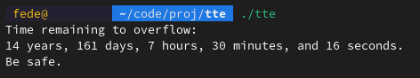
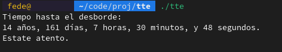

# tte
Unix traditionally counted time as seconds since Jan 1, 1970 00:00 UTC as a signed 32-bit integer.

This methods has a limit after the 2147483648th second, 03:14:07 UTC on 19 January 2038 (see [Y2K38](https://en.wikipedia.org/wiki/Year_2038_problem)).

## Configuration
The message before and after the count (`const char *intro`(2) and `const char *outro`(5)) - which includes the newline characters.

For translation purposes `static char *lapse_times`(9-16), `static char *plural`(19) and `static char *conjunction`(20) can be changed.

Configuration accounts for lanuages forming plurals in a different way than adding a suffix, with the `DIFF_PREF_PL`(24) macro and the `static char *lapse_plurals`(26-32)

## Install
```bash
git clone https://github.com/maddarikatu/tte
cd tte
make
# installing in /usr/bin/tte
sudo make install
# installing in custom path
DESTDIR=[path] make install
```

## Screenshots


